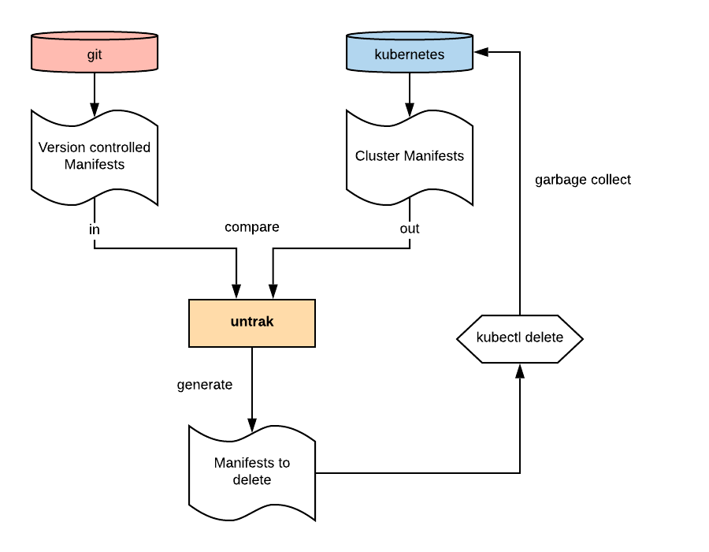

# Untrak
Find untracked resources in Kubernetes cluster, garbage collect them.

[](https://travis-ci.org/yanc0/untrak)

## Why?

When you use `kubectl apply`, `kustomize build` or `helm template` for injecting manifests through you CI/CD pipeline, kubernetes doesn't know when an object has been deleted from your repo. Your resources are now **untracked** from your delivery process and they are still managed by your clusters.

Untrak is a tool made for finding and deleting these untracked files on your cluster.


## How it works?



Via a simple config file (`untrak.yaml`), this tool will internally execute commands that output YAMLs and find resources in your clusters that are not in your SCM anymore.

In a GitOps context, this is the tool you always dreamed of.

## Installation

Download latest version on [releases page](https://github.com/yanc0/untrak/releases)

- `chmod +x untrak`
- `sudo mv untrak /usr/local/bin`
- `untrak --help`

## Example

Put a `untrak.yaml` file in you SCM.

> Note: if you have multiple environments, you would need multiple untrak config files.
```yaml
# untrak.yaml
## git sources
in:
- cmd: "cat"
  args: ["example/manifests/resources.yaml"]

## cluster manifests
out:
- cmd: "kubectl"
  args: ["get", "cm,deploy,svc,ing", "-o", "yaml", "-n", "api"]

exclude:
- namespace
```
To show untracked resources in your cluster (out) simply launch `untrak` like so:

```
$ untrak -c untrak.yaml -o text
- api/ConfigMap/django-config-b4k42gm792
- api/ConfigMap/django-config-g55mctg456
- api/Ingress/my-ingress
```

If your manifests have the namespace set to non-namespaced resource, untrak will skip the namespace. A list of supported non-namespaced resource types that will be skipped are defined by default. If you have installed more non-namespaced resource types (eg., `CRDs`), you could add extra resource types to skip namespace in comparison:
```yaml
# untrak.yaml
## git sources
in:
...

## cluster manifests
out:
...

nonNamespaced:
- some_crd_type
```

You can use environment variables on command arguments (in/out):
```yaml
in:
- cmd: "cat"
  args: ["example/$SOME_FILE_NAME"]
...
```

If you need to garbage collect them, you can change the output format to yaml and pipe the result in kubectl:

```
$ untrak -c untrak.yaml -o yaml | kubectl delete -f -
configmap "django-config-b4k42gm792" deleted
configmap "django-config-g55mctg456" deleted
ingress.extensions "my-ingress" deleted
```

If you want to fail on untracked resources (exit status 1), you can use `-fail=true`:

```
$ untrak -c untrak.yaml -fail=true
```

> **Caution**: please test this tool extensively before deleting resources. The software is provided "as is", without warranty of any kind.
